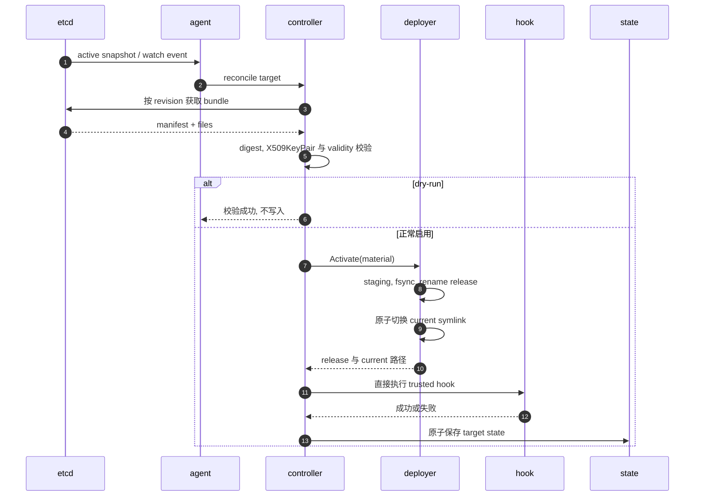

# pemcast 架构

## 定位

pemcast 是一个 pull-only certificate agent. 发布者先把完整的 immutable certificate generation 写入 etcd, 只有 generation 准备好后才移动 active pointer. 每个 agent 进程读取已配置 target 的 pointer, 校验材料, 在本地物化一个 immutable release, 并切换一个稳定的 symlink. 服务重载交给可信 hook 处理.

仓库没有内置 publisher, lease manager, service-control integration 或 HTTP API.

## 运行流程

启动时校验配置, 创建 state directory, 构造 etcd client, 并组装 reconcile controller. 当前 state 创建不会获取跨进程锁.

`agent --once` 读取一个 active-pointer snapshot, 并 reconcile 所有已配置 target.

普通 agent 模式循环执行:

1. 读取所有 active pointer, 并记录 etcd revision.
2. 并发 reconcile snapshot.
3. 从 `snapshot.Revision + 1` 开始 watch active pointer.
4. 处理相关 put 和 delete.
5. 每到达 `resync-interval` 就放弃当前 watch, 从新 snapshot 重启.
6. snapshot/watch 失败时使用有界指数退避和 jitter 重试.

watch 模式中的单个 reconcile 失败会记录日志, 不会停止进程.



## 远端模型

```text
<root>/active/<target-id> = <generation>
<root>/bundles/<target-id>/<generation>/manifest.json
<root>/bundles/<target-id>/<generation>/files/<file-name>
```

target ID, generation 和 file name 都必须是一个安全 path component, 最长 128 bytes, 只能使用字母数字, 或非开头的 `.`, `_`, `-`. bundle 按 snapshot 或 event revision 获取. unknown key, 缺失 manifest, 不安全 name 和超过 4 MiB 的文件都会被拒绝.

manifest 解码会拒绝 unknown member. 它要求 schema 为 `pemcast/v1`, file name 唯一且安全, SHA-256 为小写, pair 引用已声明文件. 实际获取的 file set 必须与声明集合完全一致. `kind` 当前没有语义校验.

whole-bundle digest 按 manifest name 顺序, 把每个 file name, 一个 NUL byte 和该文件的 raw SHA-256 写入 hasher. 本地 release name 使用这个 digest.

## Reconcile

每个 target 执行:

1. 用进程内 mutex 串行化该 target.
2. 获取全局 concurrency slot.
3. 按 event revision 获取 bundle.
4. 校验已配置 certificate/key pair, leaf validity 和声明的 pair.
5. 加载 state.
6. dry-run 模式在任何写入前停止.
7. 只在本地选中的 digest 不同 时激活.
8. 在激活后运行 hook, 或重试已记录的 hook failure.
9. 原子保存 state.

不同 target 可以并发执行. snapshot 中缺失的已配置 target 按 `delete-policy` 处理: `retain` 保留本地文件并记录日志, `fail` 返回错误. pemcast 永远不会自动删除本地 target.

## 本地启用

以 `/etc/nginx/tls` 为例:

```text
/etc/nginx/tls/
├── current -> .pemcast/releases/sha256-<digest>
└── .pemcast/releases/
    ├── sha256-old/
    └── sha256-active/
```

release 先写入 staging directory, 按配置 mappings 和 modes 填充, 写入 `.pemcast-digest`, fsync, rename 到最终 immutable release name, 再通过临时 symlink 的原子 rename 切换. active release 永远不会被 prune. `retain-releases` 只控制额外的 inactive release 数量.

内容相同的不同 generation 会映射到同一个 digest 和 release.

## Hook 与 state

hook 直接执行, 不经过 shell. 它接收选定的环境变量, 并从 stdin 获取一个 JSON event. timeout 有上界. 失败时 stdout 和 stderr 会合并, 截断到 4096 bytes 后包含在错误中.

hook 在 symlink 切换后运行. 失败会记录 `hook-error`; 后续 event 或 resync 会重试, 且不会重写未变化的 release. 如果进程在激活和 state 保存之间停止, hook 可能再次运行, 因此 hook 必须幂等.

state 是 `state-dir` 下的小 JSON 文件, 通过 temporary file, fsync, rename 和 parent-directory fsync 写入.

## 包地图

- `cmd/pemcast`: CLI 入口和 signal context.
- `internal/appcmd/agent`: application 组装与 once/watch 生命周期.
- `internal/appcmd/config`: config example 和校验命令.
- `internal/config`: schema, defaults, mode, validation 和 cfgm 集成.
- `internal/etcdsource`: etcd client, snapshot, watch 和 revision-pinned fetch.
- `internal/bundle`: manifest, digest, TLS key pair 和 validity.
- `internal/reconcile`: orchestration, lock, concurrency 和 hook retry.
- `internal/deploy`: immutable release, 原子 symlink, prune 和 fsync.
- `internal/hook`: 可信直接执行与 event schema.
- `internal/state`: 持久 activation 和 hook state.

已知边界: 没有跨进程锁, 没有直接的 etcdsource/reconcile 测试, container 只提供 binary 和 example config, publisher immutability 是外部契约.
