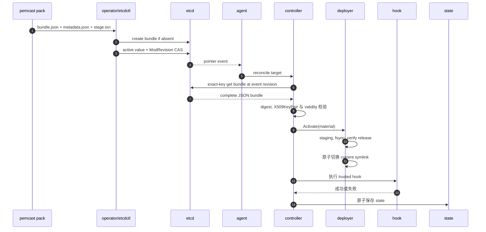

# pemcast v5 架构

## 定位

pemcast 是一个 pull-only certificate agent. `pemcast pack` 在本地校验证书并生成 immutable v5 bundle 与 etcdctl transaction 输入; 运维方先用 etcdctl stage bundle, 再用 active pointer 的 value + ModRevision CAS 提交发布. agent 只监听 active pointer, 按事件 revision exact-key 读取 bundle, 校验后在本地物化 immutable release 并切换稳定 symlink. 服务重载交给可信 hook.

仓库不包含 etcd lease manager, service-control integration 或 HTTP API. 远端发布由 `scripts/publish-v5.sh` 驱动 etcdctl, 不存在 `publish` 子命令.

## 运行流程

启动时校验配置. 非 dry-run agent 按排序获取每个 output root 的排他文件锁, 懒创建 state directory, 构造 etcd client, 并组装 reconcile controller. dry-run 不创建 state directory, 不读取 state, 不获取 output root 锁.

`agent --once` 一次 range read 读取 active prefix 下全部 pointer, 得到同一个 revision 的 snapshot, 然后 reconcile 配置 target 的交集. 普通 agent 循环执行:

1. Range read active prefix, 记录 etcd revision.
2. 并发 reconcile snapshot.
3. 从 `snapshot.Revision + 1` 开始监听 active prefix.
4. 处理 pointer put/delete; bundle stage 不产生 watch 事件.
5. 到达 `resync-interval` 时放弃 watch, 从新 snapshot 重启.
6. snapshot/watch 失败时使用有界指数退避和 jitter 重试.

watch 模式中单个 reconcile 失败只记录日志, 不停止进程.



## v5 远端模型

etcd namespace prefix 可配置, 默认 `/pemcast`. 固定子协议是 kind-first `/v5`:

```text
<etcd-prefix>/v5/active/<target-id> = <generation>
<etcd-prefix>/v5/bundles/<target-id>/<generation> = <complete JSON bundle>
```

bundle 是单 key JSON, 文件内容 base64 内联:

```json
{
  "schema": "pemcast/v5",
  "files": [
    {
      "name": "fullchain.pem",
      "kind": "certificate",
      "sha256": "<lowercase sha256>",
      "encoding": "base64",
      "data": "..."
    }
  ],
  "pairs": [
    {"certificate": "fullchain.pem", "private-key": "privkey.pem"}
  ]
}
```

约束:

- target ID 和 generation 必须是单个安全 path component, 最长 128 bytes.
- `kind` 只能是 `certificate` 或 `private-key`.
- `encoding` 只能是 `base64`.
- JSON 严格拒绝 unknown member.
- 每个 file 的 SHA-256 必须匹配原始 bytes, 不是 base64 文本.
- pair 两端必须引用正确 kind 的文件.
- 完整 encoded bundle 最大 1 MiB.
- bundle fetch 使用 exact key, 不接受 generation prefix 或额外 key.

whole-bundle digest 按排序后的文件名和原始内容 SHA-256 计算:

```text
SHA256("pemcast/v5" + NUL + for each sorted file: name + NUL + SHA256(raw content))
```

generation 固定为:

```text
sha256-<whole-bundle-digest>
```

agent 会拒绝 pointer generation 与 bundle digest 不一致的数据.

## 分阶段发布

`pemcast pack` 只读取本地证书和私钥, 不访问 etcd. 它输出:

- `bundle.json`: canonical deterministic complete JSON bundle.
- `metadata.json`: schema, prefix, target, generation, keys, encoded size, encoded bundle hash 和每个源文件 hash; 不包含私钥内容.
- `stage.txn`: etcdctl transaction, 仅当 bundle key 不存在时写入 exact bundle bytes.

发布分两步:

1. Stage immutable bundle. bundle key 不存在则创建; 已存在则要求 encoded bytes 完全相同. 任何差异都是数据损坏并必须失败.
2. Capture active pointer 的 generation 和 ModRevision, 再用 etcdctl transaction CAS pointer. 首次发布条件是 `create(active) = 0`; 更新条件是 active value 和 ModRevision 都匹配.

v5 允许存在未被 active pointer 引用的孤儿 bundle. 这是设计结果, 不是失败: bundle 是 object database, active pointer 是 ref. 消费者只 watch active prefix, 因此 bundle stage 本身没有发布语义. 唯一 commit point 是 pointer CAS 成功.

发布失败或并发冲突时可能留下已 stage 的 bundle, 可以保留给后续重试或由外部策略清理. active generation 对应的 bundle 必须永远保留.

## Reconcile

每个 target:

1. 用进程内 mutex 串行化同 target.
2. 获取全局 concurrency slot.
3. 按事件 revision exact-key 获取 bundle.
4. 校验 generation/digest, X509KeyPair, validity 和声明 pair.
5. dry-run 在任何本地访问前停止.
6. 加载 state.
7. 只在本地 selected digest 不同 时激活.
8. 激活后执行 hook, 或重试已记录 hook failure.
9. 原子保存 state.

不同 target 可以并发. snapshot 缺失 target 时按 `delete-policy` 处理: `retain` 保留本地文件并记录日志, `fail` 返回错误. agent 不自动删除本地 target.

## 本地启用

```text
/etc/nginx/tls/
├── current -> .pemcast/releases/sha256-<digest>
├── .pemcast/agent.lock
└── .pemcast/releases/
    ├── sha256-old/
    └── sha256-active/
```

release 先写入 staging directory, 按配置 mappings/modes 填充, 写入 `.pemcast-digest`, fsync, rename 到最终 immutable 目录, 再用临时 symlink 原子切换. 复用已有 release 时校验 digest marker, mapped file bytes, modes 和完整目录树. active release 永不 prune.

远端 generation 和本地 release 都由 digest 推导, 因此相同内容不会产生重复 release.

### 容器与多消费者边界

output root 是 node-local managed volume. pemcast agent 是该 volume 的唯一 writer, 应用容器是 reader. 应用必须挂载 output root 本身, 然后读取 `current/...`; 不能挂载 `current`, `current` 下的单个文件, 或使用 Kubernetes subPath 指向 `current`. 否则 container runtime 可能在启动时固定旧 release, 后续 symlink 切换无法反映到容器内.

同一台设备上的多个应用容器可以共享同一个 output root. 它们都只读挂载 root, 并由一个本机 fan-out hook 依次重载. 如果不同消费者需要不同权限或不同重载策略, 应配置成不同 target 和不同 output root.

hook 是本机服务控制适配器, 不是远端状态回报机制. 它必须运行在有权限控制目标服务的 namespace 中. host-level agent 可以直接调用 systemd, Docker 或 Podman; node agent container 需要显式挂载 hook 和对应 runtime 控制接口. local state 只服务本机 hook retry 和本地诊断, 不写入 etcd.

## Hook 与 state

hook 直接执行, 不经过 shell. 它获得固定 `PATH`, 显式放行环境变量和 `PEMCAST_*` event 变量, 并从 stdin 读取 JSON. timeout 时终止整个 process group. 失败输出在收集阶段限制为 4096 bytes.

hook 在 symlink 切换后执行. 失败记录 `hook-error`; 后续 event 或 resync 会重试, 不重写未变化 release. hook 必须幂等.

state 是 `state-dir` 下的小 JSON 文件, 通过 temporary file, fsync, rename 和 parent-directory fsync 写入.

## 包地图

- `cmd/pemcast`: CLI 入口和 signal context.
- `internal/appcmd/agent`: application 组装, output lock 与 once/watch 生命周期.
- `internal/appcmd/config`: config example 和校验命令.
- `internal/appcmd/pack`: local pack CLI adapter.
- `internal/appcmd/status`: 本地状态 CLI.
- `internal/config`: schema, defaults, validation 和 cfgm 集成.
- `internal/keyspace`: 可配置 etcd namespace prefix 与固定 `/v5` kind-first key builder.
- `internal/etcdsource`: active-prefix snapshot/watch 和 exact bundle fetch.
- `internal/bundle`: v5 单 key manifest, digest, generation 和 TLS 校验.
- `internal/pack`: local TLS 校验, deterministic bundle, metadata 和 stage transaction 生成.
- `internal/reconcile`: orchestration, lock, concurrency 和 hook retry.
- `internal/deploy`: output root lock, release 完整性, 原子 symlink, prune 和 fsync.
- `internal/hook`: process group, 环境边界, 输出限额和 event schema.
- `internal/state`: activation/hook state.
- `internal/status`: 只读本地 target 状态.
- `scripts/publish-v5.sh`: etcdctl staged publication helper.

已知边界: snapshot/watch 与真实 etcd 的集成测试仍待补充, 远端历史 generation 清理由外部策略负责.
