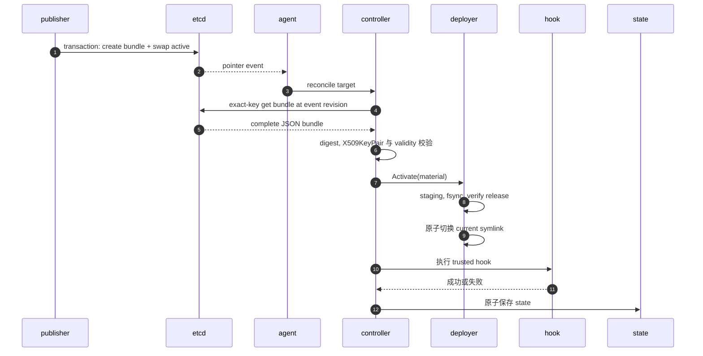

# pemcast v2 架构

## 定位

pemcast 是一个 pull-only certificate agent. publisher 从证书内容计算 content-addressed generation, 在一个 etcd transaction 中提交完整单 key bundle 和 active pointer. agent 监听 pointer, 按事件 revision 读取 bundle, 在本地物化 immutable release, 并切换稳定 symlink. 服务重载交给可信 hook.

仓库提供 `publish inspect/plan/apply/activate` CLI, 但不包含 lease manager, service-control integration 或 HTTP API.

## 运行流程

启动时校验配置. 非 dry-run agent 按排序获取每个 output root 的排他文件锁, 懒创建 state directory, 构造 etcd client, 并组装 reconcile controller. dry-run 不创建 state directory, 不读取 state, 不获取 output root 锁.

`agent --once` 读取一个 active-pointer snapshot 并 reconcile 所有 target. 普通 agent 循环执行:

1. 读取 active prefix 下所有 pointer, 记录全局 etcd revision.
2. 并发 reconcile snapshot.
3. 从 `snapshot.Revision + 1` 开始 watch active prefix.
4. 处理 pointer put/delete.
5. 到达 `resync-interval` 时放弃 watch, 从新 snapshot 重启.
6. snapshot/watch 失败时使用有界指数退避和 jitter 重试.

watch 模式中单个 reconcile 失败只记录日志, 不停止进程.



## v2 远端模型

协议 root 固定为 `/pemcast/v2`, 不可配置:

```text
/pemcast/v2/active/<target-id> = <generation>
/pemcast/v2/bundles/<target-id>/<generation> = <complete JSON bundle>
```

bundle 是单 key JSON, 文件内容 base64 内联:

```json
{
  "schema": "pemcast/v2",
  "files": [
    {
      "name": "fullchain.pem",
      "kind": "certificate",
      "sha256": "<lowercase sha256>",
      "encoding": "base64",
      "data": "..."
    }
  ],
  "pairs": [
    {"certificate": "fullchain.pem", "private-key": "privkey.pem"}
  ]
}
```

约束:

- target ID 和 generation 必须是单个安全 path component, 最长 128 bytes.
- `kind` 只能是 `certificate` 或 `private-key`.
- `encoding` 只能是 `base64`.
- JSON 严格拒绝 unknown member.
- 每个 file 的 SHA-256 必须匹配原始 bytes, 不是 base64 文本.
- pair 两端必须引用正确 kind 的文件.
- 完整 encoded bundle 最大 1 MiB.
- bundle fetch 使用 exact key, 不再接受 generation prefix 或额外 key.

whole-bundle digest 按排序后的文件名和原始内容 SHA-256 计算:

```text
SHA256("pemcast/v2" + NUL + for each sorted file: name + NUL + SHA256(raw content))
```

generation 固定为:

```text
sha256-<whole-bundle-digest>
```

agent 会拒绝 pointer generation 与 bundle digest 不一致的数据.

## 发布事务

`publish plan` 自动捕获 active pointer 当前的 absent/existing 状态, generation 和 ModRevision. 首次发布和后续发布都不需要调用者手工声明 expected generation. plan 记录 active key 的状态, 本地 bundle digest, generation, 证书/私钥文件绝对路径和各自 SHA-256. plan 不包含私钥内容.

`publish apply` 重新读取本地材料. 如果 digest 与 plan 不一致, 直接失败. 新 bundle 提交使用一个 etcd transaction:

```text
If bundle key absent
AND active generation == plan expected generation
AND active ModRevision == plan expected ModRevision

Then Put bundle key
     Put active key = generation
```

如果 bundle 已存在, 只允许完全相同的 encoded value, 然后单独用 active value + ModRevision CAS 切换 pointer. 如果 plan 捕获的 active generation 已经等于新 generation, apply 直接 no-op. 不同内容使用相同 digest属于数据损坏, 必须失败.

`publish activate` 用于回滚或重激活已有 generation. 它读取远端 bundle, 严格解码, 校验 generation/digest 和 X509KeyPair, 自动捕获当前 active 状态, 然后用 value + ModRevision CAS 切换 pointer. ModRevision 防止 `g0 -> g1 -> g0` 这类 ABA 竞争.

## Reconcile

每个 target:

1. 用进程内 mutex 串行化同 target.
2. 获取全局 concurrency slot.
3. 按事件 revision exact-key 获取 bundle.
4. 校验 generation/digest, X509KeyPair, validity 和声明 pair.
5. dry-run 在任何本地访问前停止.
6. 加载 state.
7. 只在本地 selected digest 不同 时激活.
8. 激活后执行 hook, 或重试已记录 hook failure.
9. 原子保存 state.

不同 target 可以并发. snapshot 缺失 target 时按 `delete-policy` 处理: `retain` 保留本地文件并记录日志, `fail` 返回错误. agent 不自动删除本地 target.

## 本地启用

```text
/etc/nginx/tls/
├── current -> .pemcast/releases/sha256-<digest>
├── .pemcast/agent.lock
└── .pemcast/releases/
    ├── sha256-old/
    └── sha256-active/
```

release 先写入 staging directory, 按配置 mappings/modes 填充, 写入 `.pemcast-digest`, fsync, rename 到最终 immutable 目录, 再用临时 symlink 原子切换. 复用已有 release 时校验 digest marker, mapped file bytes, modes 和完整目录树. active release 永不 prune.

远端 generation 和本地 release 都由 digest 推导, 因此相同内容不会产生重复 release.

### 容器与多消费者边界

output root 是 node-local managed volume. pemcast agent 是该 volume 的唯一 writer, 应用容器是 reader. 应用必须挂载 output root 本身, 然后读取 `current/...`; 不能挂载 `current`, `current` 下的单个文件, 或使用 Kubernetes subPath 指向 `current`. 否则 container runtime 可能在启动时固定旧 release, 后续 symlink 切换无法反映到容器内.

同一台设备上的多个应用容器可以共享同一个 output root. 它们都只读挂载 root, 并由一个本机 fan-out hook 依次重载. 如果不同消费者需要不同权限或不同重载策略, 应配置成不同 target 和不同 output root.

hook 是本机服务控制适配器, 不是远端状态回报机制. 它必须运行在有权限控制目标服务的 namespace 中. host-level agent 可以直接调用 systemd, Docker 或 Podman; node agent container 需要显式挂载 hook 和对应 runtime 控制接口. local state 只服务本机 hook retry 和本地诊断, 不写入 etcd.

## Hook 与 state

hook 直接执行, 不经过 shell. 它获得固定 `PATH`, 显式放行环境变量和 `PEMCAST_*` event 变量, 并从 stdin 读取 JSON. timeout 时终止整个 process group. 失败输出在收集阶段限制为 4096 bytes.

hook 在 symlink 切换后执行. 失败记录 `hook-error`; 后续 event 或 resync 会重试, 不重写未变化 release. hook 必须幂等.

state 是 `state-dir` 下的小 JSON 文件, 通过 temporary file, fsync, rename 和 parent-directory fsync 写入.

## 包地图

- `cmd/pemcast`: CLI 入口和 signal context.
- `internal/appcmd/agent`: application 组装, output lock 与 once/watch 生命周期.
- `internal/appcmd/config`: config example 和校验命令.
- `internal/appcmd/publish`: `publish inspect/plan/apply/activate` CLI adapter.
- `internal/appcmd/status`: 本地状态 CLI.
- `internal/config`: schema, defaults, validation 和 cfgm 集成.
- `internal/etcdsource`: 固定 v2 root, exact-key snapshot/watch/fetch, atomic transaction.
- `internal/bundle`: v2 单 key manifest, digest, generation 和 TLS 校验.
- `internal/reconcile`: orchestration, lock, concurrency 和 hook retry.
- `internal/deploy`: output root lock, release 完整性, 原子 symlink, prune 和 fsync.
- `internal/hook`: process group, 环境边界, 输出限额和 event schema.
- `internal/state`: activation/hook state.
- `internal/publisher`: publisher 领域逻辑, 包含 publish plan, atomic apply 和 activate 状态机.
- `internal/status`: 只读本地 target 状态.

已知边界: snapshot/watch 与真实 etcd 的集成测试仍待补充, 远端历史 generation 清理由外部策略负责.
