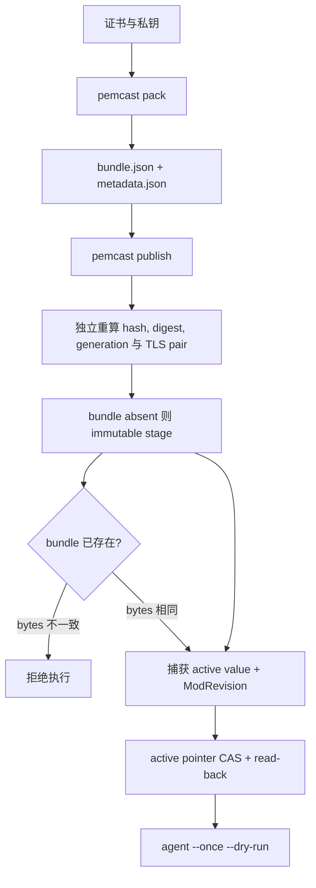

# 发布 pemcast v5 bundle

etcd namespace prefix 默认 `/pemcast`. pack CLI 通过 `--etcd-prefix` 配置, publish 与 agent 使用 `agent.etcd.prefix`. 固定子协议是 kind-first `/v5`:

```text
/pemcast/v5/active/nginx = sha256-<bundle-digest>
/pemcast/v5/bundles/nginx/sha256-<bundle-digest> = complete JSON bundle
```

generation 由 bundle 内容计算, 操作者不手工命名. 单 key JSON 将证书和私钥 base64 内联, 完整 encoded value 最大 1 MiB.



## pack

```bash
pemcast pack \
  --etcd-prefix /pemcast \
  --target nginx \
  --certificate fullchain.pem \
  --private-key privkey.pem \
  --output-dir /secure/tmp/nginx-pack
```

`pack` 不访问 etcd, 会执行:

1. 读取证书和私钥.
2. 校验 `tls.X509KeyPair`.
3. 计算每个文件 SHA-256 和 whole-bundle digest.
4. 推导 `sha256-<digest>` generation.
5. 生成 canonical deterministic `bundle.json`.
6. 生成不含私钥内容的 `metadata.json`, 包含 encoded bundle SHA-256.
7. 生成手动 etcdctl 方法使用的 `stage.txn`.

输出目录必须不存在. `bundle.json` 与 `stage.txn` 包含私钥, 权限为 0600; 整个 pack 目录应保存在受限存储中并在使用后清理.

## 推荐 publish

`pemcast publish` 复用 `agent.etcd` 的 endpoints, TLS, timeout 和 prefix 配置; user 由命令特定环境模板解析:

```bash
PEMCAST_AGENT_ETCD_ENDPOINTS='["https://etcd.example:2379"]' \
ETCDCTL_USER_PUBLISH='publisher-ci:<password>' \
PEMCAST_AGENT_ETCD_PREFIX='/pemcast' \
pemcast publish --pack-dir /secure/tmp/nginx-pack
```

也可以使用配置文件:

```bash
pemcast --config /etc/pemcast/publish.yaml publish --pack-dir /secure/tmp/nginx-pack
```

publish 的 user 环境变量优先级是 `ETCDCTL_USER_PUBLISH`, `ETCDCTL_USER`. 值使用 etcdctl 的 `username:password` 格式, 并按第一个冒号切分, 密码可以继续包含冒号.

`publish` 会:

1. 严格解析 `metadata.json`, 拒绝 unknown member.
2. 校验 encoded bundle SHA-256 与 encoded size.
3. 严格解码 bundle, 重算每个文件 hash, whole digest 和 generation.
4. 校验 TLS pair.
5. 校验 metadata prefix, target, active key 和 bundle key.
6. 拒绝 pack prefix 与当前 `agent.etcd.prefix` 不一致.
7. Stage immutable bundle; 同 generation 已存在时要求 bytes 完全相同.
8. 捕获 active value 与 ModRevision.
9. active 已等于目标 generation 时返回 no-op.
10. 首次发布用 `create(active) = 0` CAS; 更新用 active value + ModRevision CAS.
11. 成功后 read-back active pointer, 必须等于目标 generation.

bundle stage 可能留下未被引用的孤儿 bundle. 这是允许的中间状态; active pointer CAS 是唯一发布 commit point. 并发冲突时命令失败退出, 重新执行同一 pack 是安全操作.

## 手动 etcdctl fallback

仅在应急, 审计或明确不使用 Go client 时使用:

```bash
ETCDCTL_ENDPOINTS='https://etcd.example:2379' \
ETCDCTL_USER='publisher-ci:<password>' \
bash .agents/skills/repo-deployment/scripts/publish-v5.sh \
  --pack-dir /secure/tmp/nginx-pack
```

要求:

- etcdctl 3.7+.
- jq, base64, cmp 和 sha256sum.
- TLS 参数复用 `ETCDCTL_CACERT`, `ETCDCTL_CERT` 和 `ETCDCTL_KEY`.

helper 会从 `bundle.json` 重新生成 stage transaction, 并与 `stage.txn` 逐字节比对; bundle key 已存在时也要求远端 bytes 与本地 `bundle.json` 完全相同. 它维护与 `pemcast publish` 相同的 v5 invariant, 但不是产品镜像的一部分, 也不是 CI 默认路径.

## 发布后验证

native publish 已在返回成功前完成 active pointer read-back. 如需独立检查:

```bash
etcdctl get /pemcast/v5/active/nginx --print-value-only
etcdctl get "/pemcast/v5/bundles/nginx/$(etcdctl get /pemcast/v5/active/nginx --print-value-only)" \
  --print-value-only | jq -r '.schema'
```

在消费者节点执行:

```bash
pemcast --config /etc/pemcast/config.yaml agent --once --dry-run
pemcast --config /etc/pemcast/config.yaml agent --once
pemcast --config /etc/pemcast/config.yaml status --json
```

确认 local current digest 与远端 generation 的 digest 一致. watch 模式会自动触发 reconcile; `agent --once` 用于显式同步.

## 回滚

回滚是重新执行旧 pack 的 pointer CAS, 不重写 bundle:

```bash
PEMCAST_AGENT_ETCD_ENDPOINTS='["https://etcd.example:2379"]' \
ETCDCTL_USER_PUBLISH='publisher-ci:<password>' \
PEMCAST_AGENT_ETCD_PREFIX='/pemcast' \
pemcast publish --pack-dir /secure/archive/nginx-pack-sha256-old
```

如果旧 pack 目录没有保留, 使用当时完全相同的证书和私钥重新 `pemcast pack`; deterministic generation 与 bundle bytes 会相同. 不建议只凭 generation 字符串盲写 pointer. 回滚后执行 `agent --once --dry-run` 和 `agent --once`.

## 运维规则

- 不修改已存在的 generation; 同 key 不同 bytes 必须失败.
- 不手工指定或复用 generation 名.
- 不绕过 `pemcast publish` 或手动 helper 直接写 active pointer, 除非正在处理已确认的 etcd 故障.
- pack 目录包含私钥 bundle, 只能存放在 0700 目录和受限存储中.
- 远端历史 bundle 清理由独立运维策略负责, 必须永远保留 active generation.
- pemcast 镜像不包含 etcdctl 或 jq; 手动 helper 由执行环境自行提供依赖.
