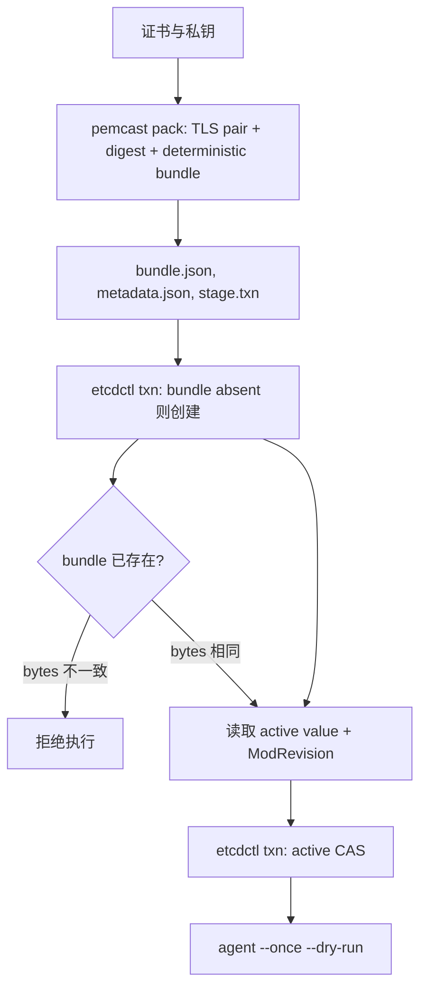

# 发布 pemcast v5 bundle

etcd namespace prefix 默认 `/pemcast`, pack CLI 通过 `--etcd-prefix` 配置, agent 配置使用 `agent.etcd.prefix`. 固定子协议是 kind-first `/v5`:

```text
/pemcast/v5/active/nginx = sha256-<bundle-digest>
/pemcast/v5/bundles/nginx/sha256-<bundle-digest> = complete JSON bundle
```

generation 由 bundle 内容计算, 操作者不手工命名. 单 key JSON 将证书和私钥 base64 内联, 完整 encoded value 最大 1 MiB.



## pack

```bash
pemcast pack \
  --etcd-prefix /pemcast \
  --target nginx \
  --certificate fullchain.pem \
  --private-key privkey.pem \
  --output-dir /secure/tmp/nginx-pack
```

`pack` 不访问 etcd, 会执行:

1. 读取证书和私钥.
2. 校验 `tls.X509KeyPair`.
3. 计算每个文件 SHA-256 和 whole-bundle digest.
4. 推导 `sha256-<digest>` generation.
5. 生成 canonical deterministic `bundle.json`.
6. 生成不含私钥内容的 `metadata.json`, 包含 encoded bundle SHA-256 供发布前校验.
7. 生成只在 bundle key absent 时创建 bundle 的 `stage.txn`.

输出目录必须不存在. `bundle.json` 与 `stage.txn` 包含私钥, 权限为 0600; 整个 pack 目录应保存在受限存储中并在使用后清理.

## publish

推荐使用仓库 helper:

```bash
ETCDCTL_ENDPOINTS='https://etcd.example:2379' \
ETCDCTL_USER='publisher-ci:<password>' \
scripts/publish-v5.sh --pack-dir /secure/tmp/nginx-pack
```

TLS 参数复用 etcdctl 标准环境变量 `ETCDCTL_CACERT`, `ETCDCTL_CERT` 和 `ETCDCTL_KEY`. helper 使用 etcdctl 3.7+ transaction 语法.

helper 的顺序是:

1. 校验 metadata schema, prefix, target, generation 与 active/bundle key 一致.
2. 执行 `stage.txn`; 如果 bundle 已存在, 读取远端 value 并要求与本地 `bundle.json` bytes 完全相同.
3. 读取 active pointer 的当前 generation 和 ModRevision.
4. 如果 active 已经等于目标 generation, 直接 no-op.
5. 首次发布使用 `create(active) = 0` CAS; 更新使用 active value + ModRevision CAS.

bundle stage 可能留下未被引用的孤儿 bundle. 这是允许的中间状态; active pointer CAS 是唯一发布 commit point. 并发冲突时 helper 失败退出, 重新执行同一 pack 是安全操作.

## 发布后验证

在发布端执行:

```bash
etcdctl get /pemcast/v5/active/nginx --print-value-only
etcdctl get "/pemcast/v5/bundles/nginx/$(etcdctl get /pemcast/v5/active/nginx --print-value-only)" \
  --print-value-only | jq -r '.schema'
```

在消费者节点执行:

```bash
pemcast --config /etc/pemcast/config.yaml agent --once --dry-run
pemcast --config /etc/pemcast/config.yaml agent --once
pemcast --config /etc/pemcast/config.yaml status --json
```

确认 local current digest 与远端 generation 的 digest 一致. watch 模式会自动触发 reconcile; `agent --once` 用于显式同步.

## 回滚

回滚是重新执行旧 pack 的 pointer CAS, 不重写 bundle:

```bash
ETCDCTL_ENDPOINTS='https://etcd.example:2379' \
ETCDCTL_USER='publisher-ci:<password>' \
scripts/publish-v5.sh --pack-dir /secure/archive/nginx-pack-sha256-old
```

如果旧 pack 目录没有保留, 使用当时完全相同的证书和私钥重新 `pemcast pack`; deterministic generation 与 bundle bytes 会相同. 不建议只凭 generation 字符串盲写 pointer. 回滚后执行 `agent --once --dry-run` 和 `agent --once`.

## 运维规则

- 不修改已存在的 generation; 同 key 不同 bytes 必须失败.
- 不手工指定或复用 generation 名.
- 不绕过 helper 直接写 active pointer, 除非正在处理已确认的 etcd 故障.
- pack 目录包含私钥 bundle, 只能存放在 0700 目录和受限存储中.
- 远端历史 bundle 清理由独立运维策略负责, 必须永远保留 active generation.
- 使用 etcdctl 3.7+; pemcast 镜像从官方 etcd v3.7.2 镜像复制 etcdctl.
