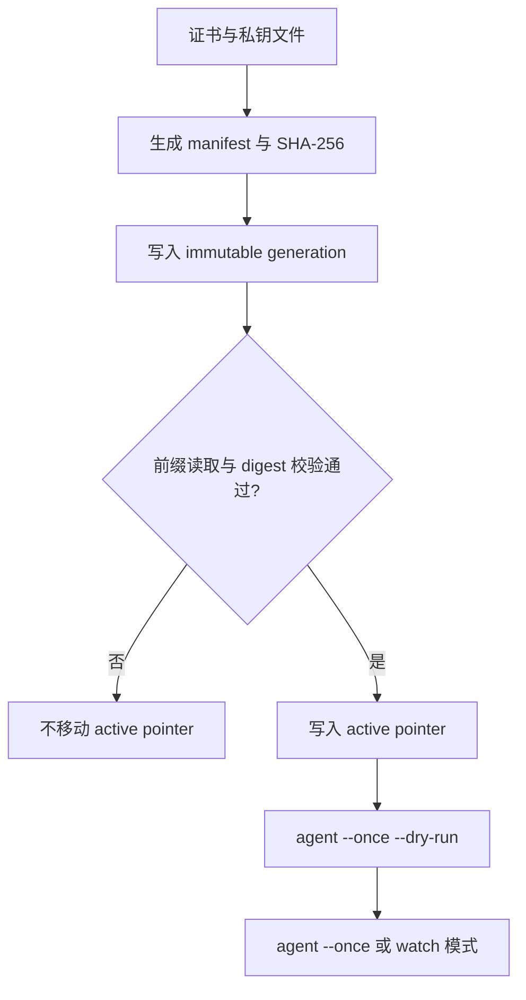

# 发布 pemcast bundle

以 target `nginx`, generation `01K4GENERATION`, root `/pemcast/v1` 为例:

```text
/pemcast/v1/active/nginx = 01K4GENERATION
/pemcast/v1/bundles/nginx/01K4GENERATION/manifest.json
/pemcast/v1/bundles/nginx/01K4GENERATION/files/fullchain.pem
/pemcast/v1/bundles/nginx/01K4GENERATION/files/privkey.pem
```

先写入并校验所有 bundle key, 最后移动 pointer. generation 不可变; 任何内容变化都使用新名字.



准备 manifest:

```bash
TARGET=nginx
GENERATION=01K4GENERATION
ROOT=/pemcast/v1
CERT_SHA256="$(sha256sum fullchain.pem | awk '{print $1}')"
KEY_SHA256="$(sha256sum privkey.pem | awk '{print $1}')"

cat > manifest.json <<EOF
{
  "schema": "pemcast/v1",
  "files": [
    {"name":"fullchain.pem","kind":"certificate","sha256":"$CERT_SHA256"},
    {"name":"privkey.pem","kind":"private-key","sha256":"$KEY_SHA256"}
  ],
  "pairs": [
    {"certificate":"fullchain.pem","private-key":"privkey.pem"}
  ]
}
EOF
```

设置 `ETCDCTL_ENDPOINTS` 和目标集群的 authentication/TLS 选项后执行:

```bash
BUNDLE="$ROOT/bundles/$TARGET/$GENERATION"
etcdctl put "$BUNDLE/files/fullchain.pem" -- < fullchain.pem
etcdctl put "$BUNDLE/files/privkey.pem" -- < privkey.pem
etcdctl put "$BUNDLE/manifest.json" -- < manifest.json
etcdctl get "$BUNDLE/" --prefix
```

确认 key 集合和 digest 完全正确. 每个文件最大 4 MiB, 实际获取和声明的 file set 必须完全一致.

校验完成后才能启用:

```bash
OLD="$(etcdctl get "$ROOT/active/$TARGET" --print-value-only)"
if [ -n "$OLD" ]; then
  etcdctl put "$ROOT/active/$TARGET" "$GENERATION" --prev-value="$OLD"
else
  etcdctl put "$ROOT/active/$TARGET" "$GENERATION"
fi
```

然后执行 dry-run 和同步:

```bash
pemcast --config /etc/pemcast/config.yaml agent --once --dry-run
pemcast --config /etc/pemcast/config.yaml agent --once
```

回滚就是把 pointer 移回另一个完整的 immutable 旧 generation. 相同内容会解析到同一个 digest, 因此可能不会重写本地文件或触发 hook.

publisher 义务: 不修改已暴露的 generation, 保留旧 generation 用于回滚, 哈希精确 bytes, 安全保存凭据, 最后移动 pointer.
