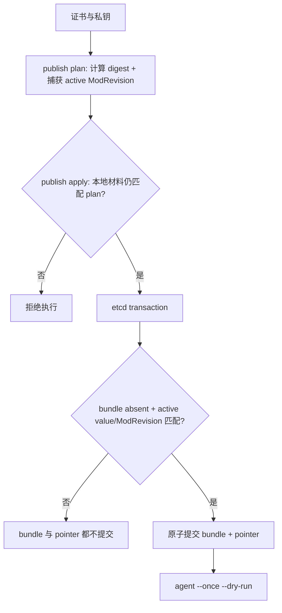

# 发布 pemcast v2 bundle

v2 协议固定使用 `/pemcast/v2`, 不做 v1 兼容或迁移:

```text
/pemcast/v2/active/nginx = sha256-<bundle-digest>
/pemcast/v2/bundles/nginx/sha256-<bundle-digest> = complete JSON bundle
```

generation 由 bundle 内容计算, 操作者不手工命名. 单 key JSON 将证书和私钥 base64 内联, 完整 encoded value 最大 1 MiB.



## 首次发布

生成计划:

```bash
pemcast --config /etc/pemcast/config.yaml publish plan \
  --target nginx \
  --certificate fullchain.pem \
  --private-key privkey.pem \
  --initial \
  --output first-release.json
```

执行:

```bash
pemcast --config /etc/pemcast/config.yaml publish apply \
  --plan first-release.json
```

## 后续发布

先获取当前 active generation. 可以从 `pemcast status --json` 的本地 state 或受控 etcd 只读命令获得, 然后显式写入计划:

```bash
pemcast --config /etc/pemcast/config.yaml publish plan \
  --target nginx \
  --certificate fullchain.pem \
  --private-key privkey.pem \
  --expected-active-generation sha256-current \
  --output release.json
```

执行:

```bash
pemcast --config /etc/pemcast/config.yaml publish apply \
  --plan release.json
```

`publish plan` 会:

1. 读取证书和私钥.
2. 校验 `tls.X509KeyPair`.
3. 计算每个文件的 SHA-256 和 whole-bundle digest.
4. 推导 `sha256-<digest>` generation.
5. 检查 active pointer 是否处于显式预期状态.
6. 记录 active key ModRevision.
7. 输出本地文件路径和 digest, 不输出私钥内容.

`publish apply` 会重新读取本地文件. 如果证书, 私钥或 digest 在 plan 后变化, 直接失败. 新 bundle 走一个 etcd transaction:

```text
If bundle key absent
AND active generation matches
AND active ModRevision matches

Then Put complete bundle
     Put active pointer
```

任一条件失败时, bundle 和 pointer 都不会提交. 如果同 digest bundle 已存在, 只允许完全相同的内容, 然后单独用 active value + ModRevision CAS 切换 pointer.

## 回滚

回滚不重写 bundle. 先取得当前 active generation 和 active key ModRevision:

```bash
etcdctl get /pemcast/v2/active/nginx --write-out=json |
  jq -r '.kvs[0].mod_revision, (.kvs[0].value | @base64d)'
```

然后执行:

```bash
pemcast --config /etc/pemcast/config.yaml publish activate \
  --target nginx \
  --generation sha256-old \
  --expected-active-generation sha256-current \
  --expected-active-mod-revision 123
```

`publish activate` 会严格解码远端 bundle, 校验 digest/generation 和 X509KeyPair. 只有 active value 和 ModRevision 都匹配时才切换. 这可以防止并发发布或 `g0 -> g1 -> g0` ABA 竞争.

## 发布后验证

在消费者节点执行:

```bash
pemcast --config /etc/pemcast/config.yaml agent --once --dry-run
pemcast --config /etc/pemcast/config.yaml status --json
```

确认 local current digest 与远端 generation 的 digest 一致. watch 模式会自动触发 reconcile; `agent --once` 用于显式同步.

## 运维规则

- 不修改已暴露的 generation.
- 不手工指定或复用 generation 名.
- 不用 etcdctl 常规写入 v2 数据.
- plan 文件权限应为 0600, 因为它暴露证书路径和 digest 元数据.
- 远端历史 bundle 清理由独立运维策略负责, 必须永远保留 active generation.
- v1 数据不能被 v2 agent 消费; 需要重新用 v2 publisher 发布.
