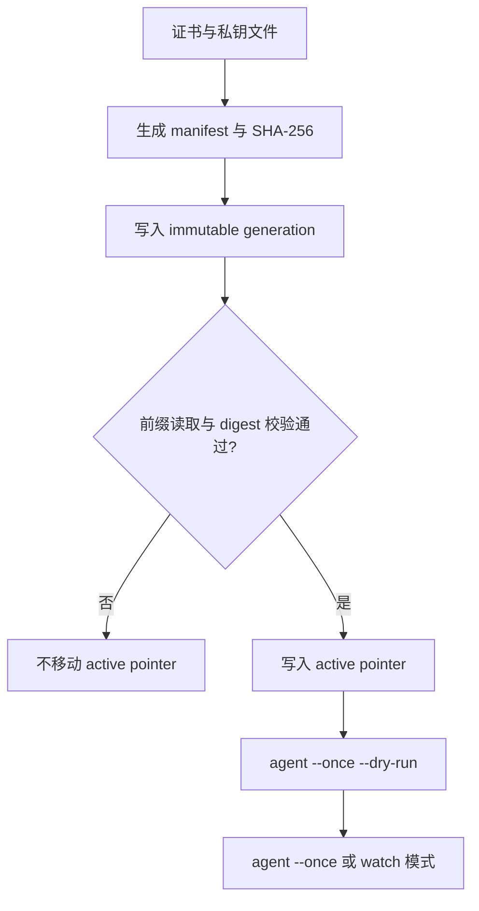

# 发布 pemcast bundle

以 target `nginx`, generation `01K4GENERATION`, root `/pemcast/v1` 为例:

```text
/pemcast/v1/active/nginx = 01K4GENERATION
/pemcast/v1/bundles/nginx/01K4GENERATION/manifest.json
/pemcast/v1/bundles/nginx/01K4GENERATION/files/fullchain.pem
/pemcast/v1/bundles/nginx/01K4GENERATION/files/privkey.pem
```

先创建并校验所有 bundle key, 最后移动 pointer. generation 不可变; 任何内容变化都使用新名字, 已存在 generation 不会被覆盖.



优先使用内置 publisher:

```bash
pemcast --config /etc/pemcast/config.yaml publisher \
  --target nginx \
  --generation 01K4GENERATION \
  --certificate fullchain.pem \
  --private-key privkey.pem \
  --previous-generation 01K4PREVIOUS
```

首次发布且 active pointer 不存在时, 用 `--allow-missing-active` 替代 `--previous-generation`. publisher 会先在本地校验 key pair, 生成 manifest, 用 absent CAS 创建 generation key, 读回校验 digest, 最后用 expected previous pointer CAS 写 active pointer. 任一步失败都不会移动 pointer.

手工 `etcdctl` 只应用于灾备排查, 不应成为常规发布路径. 手工流程必须保持 absent creation, 完整读回校验和 pointer CAS, 不允许覆盖已存在的 generation key.

manifest 结构如下, `kind` 只允许 `certificate` 和 `private-key`:

```json
{
  "schema": "pemcast/v1",
  "files": [
    {"name": "fullchain.pem", "kind": "certificate", "sha256": "<lowercase sha256>"},
    {"name": "privkey.pem", "kind": "private-key", "sha256": "<lowercase sha256>"}
  ],
  "pairs": [
    {"certificate": "fullchain.pem", "private-key": "privkey.pem"}
  ]
}
```

每个文件最大 4 MiB, 实际获取和声明的 file set 必须完全一致.

回滚到已有 immutable generation 时不重写 bundle:

```bash
pemcast --config /etc/pemcast/config.yaml publisher \
  --target nginx \
  --generation 01K4PREVIOUS \
  --activate-existing \
  --previous-generation 01K4CURRENT
```

然后执行 dry-run 和同步:

```bash
pemcast --config /etc/pemcast/config.yaml agent --once --dry-run
pemcast --config /etc/pemcast/config.yaml agent --once
```

相同内容会解析到同一个 digest, 因此本地可能不会重写文件, 也可能不会触发 hook.

publisher 义务: 不修改已暴露的 generation, 保留旧 generation 用于回滚, 哈希精确 bytes, 安全保存凭据, 最后移动 pointer.
