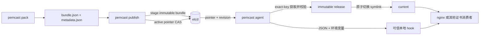

# pemcast

pemcast 是一个从 etcd 拉取 TLS 证书的本地 agent, 同时提供 v5 staged publisher. `pemcast pack` 从证书内容计算 content-addressed generation, 并生成 deterministic bundle 与 metadata; `pemcast publish` 先 stage immutable bundle, 再用 active pointer 的 value + ModRevision CAS 提交发布. pemcast agent 监听指针变化, 按事件 revision 取回 bundle, 校验 SHA-256 与证书/私钥匹配关系, 然后在本地生成不可变 release 并原子切换 `current` symlink. 应用始终读取稳定路径, hook 在切换成功后触发服务重载.



## 设计要点

- 证书发布者与消费者解耦: pemcast 不包含签发, 审批, lease manager 或 HTTP API.
- 远端 generation 内容寻址: generation 由完整 bundle digest 计算, 相同内容天然相同, 内容变化必然得到新名字.
- 发布分阶段: bundle 是 immutable object database, active pointer 是 ref; bundle 先 stage, pointer CAS 是唯一 commit point.
- 并发安全: 首次发布比较 create revision, 更新比较 active value + ModRevision; 冲突失败而不是覆盖.
- 校验发生在启用前: manifest 严格解析, 文件逐一校验 SHA-256, 证书和私钥必须通过 `tls.X509KeyPair`, 并满足有效期策略.
- 本地发布内容寻址: release 目录名来自 bundle digest, 相同内容不会重复写入; 复用前校验 marker, bytes, mode 和目录树.
- 应用路径稳定: 应用读取 `current/...`, pemcast 通过临时 symlink 和 rename 原子切换目标.
- output root 互斥: 非 dry-run agent 按排序获取每个 root 的 `.pemcast/agent.lock`, 并持有到进程退出.
- dry-run 无本地写入: 不创建 state directory 和 output root, 不读写 state, 不执行 deploy 或 hook.
- 服务重载可重试: hook 在本地切换后执行, 失败记录在 state 中, 由后续事件或周期 resync 重试.

## 快速上手

生成并修改 agent 配置:

```bash
pemcast config example > config/config.yaml
pemcast --config config/config.yaml config validate
```

至少配置 `agent.etcd.endpoints`, 一个 target 的 `output.root`, mappings, validation pair 和 hook.

etcd namespace prefix 默认 `/pemcast`. agent 与 publish 通过 `agent.etcd.prefix` 或 `PEMCAST_AGENT_ETCD_PREFIX` 配置, pack CLI 通过 `--etcd-prefix` 配置. 程序只硬编码 `/v5` 子协议:

```text
/pemcast/v5/active/nginx = sha256-<bundle-digest>
/pemcast/v5/bundles/nginx/sha256-<bundle-digest> = complete JSON bundle
```

etcd 认证使用单个 `username:password` 值, 按第一个冒号切分, 密码可以继续包含冒号. agent 依次读取 `ETCDCTL_USER_AGENT`, `ETCDCTL_USER`; publish 依次读取 `ETCDCTL_USER_PUBLISH`, `ETCDCTL_USER`.

本地打包:

```bash
pemcast pack \
  --etcd-prefix /pemcast \
  --target nginx \
  --certificate fullchain.pem \
  --private-key privkey.pem \
  --output-dir /secure/tmp/nginx-pack
```

输出文件是:

```text
/secure/tmp/nginx-pack/
├── bundle.json
├── metadata.json
└── stage.txn
```

`pack` 不访问 etcd. `bundle.json` 与 `stage.txn` 包含私钥, 文件权限为 0600; pack 目录只能保存在受限存储中.

使用 native publish 发布:

```bash
PEMCAST_AGENT_ETCD_ENDPOINTS='["https://etcd.example:2379"]' \
ETCDCTL_USER_PUBLISH='publisher-ci:<password>' \
PEMCAST_AGENT_ETCD_PREFIX='/pemcast' \
pemcast publish --pack-dir /secure/tmp/nginx-pack
```

publish 读取 pack 后独立重算 encoded hash, 文件 hash, whole digest, generation 和 TLS pair. 如果 bundle key 已存在, 必须与本地 `bundle.json` bytes 完全相同. 然后捕获 active pointer, 首次发布用 `create(active) = 0` CAS, 更新用 active value + ModRevision CAS. active 已经等于目标 generation 时直接 no-op, 成功后 read-back active pointer.

bundle stage 可能留下未被引用的孤儿 bundle; 这不产生消费者事件, 也不会改变本地证书. 只有 pointer CAS 成功才是发布 commit point.

先不落盘测试远端内容:

```bash
pemcast --config config/config.yaml agent --once --dry-run
```

再执行一次同步或进入监听模式:

```bash
pemcast --config config/config.yaml agent --once
pemcast --config config/config.yaml agent
```

agent 一次 range read 读取 active prefix 下全部 pointer, 记录同一个 revision, 然后只监听 active prefix. bundle stage 不产生 watch 事件. controller 只 reconcile 配置中的 target, bundle fetch 使用 exact key.

本地布局为:

```text
/etc/nginx/tls/
├── current -> .pemcast/releases/sha256-...
└── .pemcast/
    ├── agent.lock
    └── releases/
        ├── sha256-old/
        └── sha256-current/
```

应用读取:

```text
/etc/nginx/tls/current/fullchain.pem
/etc/nginx/tls/current/privkey.pem
```

## 容器部署契约

pemcast 是 node-level agent. 推荐每台设备运行一个 agent, 由它统一管理本机证书 output root 并执行本机 reload hook. 应用容器只需要以只读方式挂载完整 output root:

```bash
docker run \
  -v /var/lib/pemcast/nginx:/etc/nginx/tls:ro \
  gateway-image
```

必须挂载 output root 本身, 不能挂载 `current`, `current/fullchain.pem` 或 `current/privkey.pem`. Kubernetes 中也不要用 subPath 指向 `current`. 否则 container runtime 可能在启动时固定旧 release, pemcast 后续切换 symlink 时应用看不到新证书.

同一台设备上多个容器可以使用同一个 output root. 它们都挂载 root, 并由一个本机 fan-out hook 统一重载:

```bash
#!/bin/sh
set -eu

docker exec gateway nginx -s reload
docker kill --signal=HUP api
```

hook 是本机服务控制适配器, 必须运行在有权限控制目标服务的位置. 如果 pemcast 以容器方式运行, 它需要挂载 output root, hook 以及对应容器 runtime 控制接口. 挂载 Docker socket 或 Podman socket 等价于高权限, 只应部署在受信任的 node agent 容器中.

pemcast 现阶段不向 etcd 回报设备状态. local state 只用于本机 hook retry 和 `pemcast status` 诊断, 设备离线后重新上线会继续从 etcd 收敛到 active generation.

配置会拒绝重复或祖先/后代重叠的 output root. 同一个 root 的第二个 agent 进程会因文件锁立即失败.

## 租户 prefix 与 target 级 bundle RBAC

agent 保持只读. publisher 单独具备写入权限. active prefix 是租户内控制面, bundle 是敏感数据面:

```text
agent-active:<etcd-prefix>/v5 read <etcd-prefix>/v5/active/ prefix
agent-bundles:<etcd-prefix>/v5:<target-id> read <etcd-prefix>/v5/bundles/<target-id>/ prefix
publisher:<etcd-prefix>/v5:<target-id> readwrite <etcd-prefix>/v5/active/<target-id>
publisher:<etcd-prefix>/v5:<target-id> readwrite <etcd-prefix>/v5/bundles/<target-id>/ prefix
```

一个 etcd user 可以挂一个 active reader role 和多个 target bundle role. 例如 `agent-node-a` 读取租户 active metadata, 但只能读取 `nginx` 和 `api` 的私钥 bundle. 不同租户使用不同 prefix 和不同 etcd users.

初始化或追加 target 授权:

```bash
ETCDCTL_ENDPOINTS='https://etcd.example:2379' \
bash .agents/skills/repo-deployment/scripts/init-rbac.sh \
  --etcd-prefix /pemcast \
  --agent-user agent-node-a \
  --publisher-user publisher-ci \
  nginx api.example.com
```

脚本会验证授权 active/bundle 可读, publisher 可写 bundle probe, agent 写入被拒绝, 未授权 target bundle 读取被拒绝, 以及未认证读取被拒绝.

## CI 中直接发布

发布镜像包含 linux/amd64 `pemcast`. GitHub Actions 已有 Docker 服务, 不需要提取二进制, 安装 Go, 使用 ORAS, etcdctl, jq 或配置 GHCR 凭据:

```bash
_image="ghcr.io/lwmacct/260907-pemcast:<version>"
_work="$(mktemp -d)"

docker run --rm --platform linux/amd64 \
  --volume "${CERTBOT_OUTPUT_DIR}/cert:/certs:ro" \
  --volume "${_work}:/work" \
  "${_image}" \
  pemcast pack \
    --etcd-prefix /pemcast \
    --target nginx \
    --certificate /certs/fullchain.pem \
    --private-key /certs/privkey.pem \
    --output-dir /work/pack

docker run --rm --platform linux/amd64 \
  --volume "${_work}:/work:ro" \
    -e PEMCAST_AGENT_ETCD_ENDPOINTS='["https://etcd.example:2379"]' \
    -e ETCDCTL_USER_PUBLISH='publish:...' \
    -e PEMCAST_AGENT_ETCD_PREFIX='/pemcast' \
  "${_image}" \
    pemcast publish --pack-dir /work/pack
```

如果 etcd 使用 mTLS, 同时挂载 CA/client cert/key 并设置 `PEMCAST_AGENT_ETCD_TLS_*` 环境变量. 使用 exact version tag 或 digest.

需要应急或审计时, 可以在 pemcast 镜像外运行仓库中的 `.agents/skills/repo-deployment/scripts/publish-v5.sh`, 手动执行 etcdctl 事务. 该 helper 不进入产品镜像.

## 回滚

保留旧 pack 目录时, 重新执行 `pemcast publish` 即可把 pointer CAS 回旧 generation:

```bash
PEMCAST_AGENT_ETCD_ENDPOINTS='["https://etcd.example:2379"]' \
ETCDCTL_USER_PUBLISH='publisher-ci:<password>' \
PEMCAST_AGENT_ETCD_PREFIX='/pemcast' \
pemcast publish --pack-dir /secure/archive/nginx-pack-sha256-old
```

如果旧 pack 目录没有保留, 使用当时完全相同的证书和私钥重新 `pemcast pack`; deterministic generation 与 bundle bytes 会相同. 回滚后执行 `agent --once --dry-run` 和 `agent --once`.

## v4 到 v5 破坏式切换

pemcast v5 不读取, 不迁移和不兼容 v2/v3/v4 数据. 推荐切换顺序:

1. 初始化 v5 active reader, target bundle 和 publisher roles/users.
2. 使用 v5 `pack` + `publish` 将现有证书重新发布到 `<prefix>/v5/...`.
3. 将 agent 配置和镜像升级到 v5, 保持同一个 `agent.etcd.prefix`.
4. 执行 `agent --once --dry-run`, 再执行一次同步或重启 watch agent.
5. 用 `etcdctl` 核对 v5 active/bundle 和未授权访问.
6. 确认消费端证书正常后, 删除旧 protocol prefixes 和旧 roles/users.

## Hook 契约

配置的可执行文件会在启用后直接运行, 不经过 shell. 它会从 stdin 接收一个 JSON 事件, 并获得以下环境变量:

```text
PEMCAST_TARGET
PEMCAST_GENERATION
PEMCAST_PREVIOUS_GENERATION
PEMCAST_ETCD_REVISION
PEMCAST_RELEASE_DIR
PEMCAST_CURRENT_DIR
PEMCAST_CHANGED_FILES
PEMCAST_BUNDLE_SHA256
```

hook 必须幂等. 失败时新证书文件可能已经启用, pemcast 会记录失败并在下一次 watch 事件或周期性 resync 时重试, 且不会重写同一个 release.

hook 默认只获得固定 `PATH` 和 `PEMCAST_*` 事件变量. 需要继承其他环境变量时, 在 `hook.pass-environment` 中显式列出变量名. hook 输出最多收集 4096 bytes, 超时会终止整个 process group.

## 命令

```text
pemcast agent
pemcast agent --once
pemcast agent --once --dry-run
pemcast config example
pemcast config validate
pemcast pack
pemcast publish
pemcast status --json
pemcast version
```

配置由 `cfgm` 加载, 优先级为: 默认值, 第一个可用默认配置文件, 显式 `--config` 文件, `PEMCAST_*` 环境变量, 显式命令行参数.

## 项目 skills

仓库在 `.agents/skills/` 中包含三个 Codex skills:

- `$repo-architecture`: 架构, 包边界, 同步不变量和失败行为.
- `$repo-deployment`: agent 配置, pack/publish 发布, 手动 etcdctl fallback, 回滚, 运维和诊断.
- `$repo-development`: Go 修改, 包级测试, 生成配置, 构建和发布要求.

详细 references 位于:

- `.agents/skills/repo-architecture/references/architecture.md`
- `.agents/skills/repo-deployment/references/operation.md`
- `.agents/skills/repo-deployment/references/publishing.md`
- `.agents/skills/repo-development/references/development.md`

## 开发

```bash
go test ./...
go run ./cmd/pemcast --help
go run ./cmd/pemcast --config config/config.yaml config validate
```

`config/config.example.yaml` 由 `internal/config` 测试生成. 修改配置 schema 后运行 `go test ./internal/config`, 并提交更新后的示例文件.
