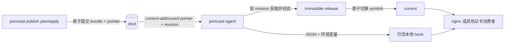

# pemcast

pemcast 是一个从 etcd 拉取 TLS 证书的本地 agent. publisher 从证书内容计算 generation, 并在一个 etcd transaction 中原子提交完整单 key bundle 和 active pointer; pemcast 监听指针变化, 按事件 revision 取回 bundle, 校验 SHA-256 与证书/私钥匹配关系, 然后在本地生成不可变 release 并原子切换 `current` symlink. 应用始终读取稳定路径, hook 在切换成功后触发服务重载.



## 设计要点

- 证书发布者与消费者解耦: pemcast 不包含签发或审批系统, 但提供安全 `publish inspect/plan/apply/activate` 命令.
- 远端 generation 内容寻址: generation 由完整 bundle digest 计算, 相同内容天然相同, 内容变化必然得到新名字.
- 校验发生在启用前: manifest 严格解析, 文件逐一校验 SHA-256, 证书和私钥必须通过 `tls.X509KeyPair`, 并满足有效期策略.
- 本地发布是内容寻址的: release 目录名来自整个 bundle 的 digest, 相同内容不会重复写入. 复用 release 前会校验 marker, 文件内容, mode 和目录树.
- 应用路径稳定: 应用读取 `current/...`, pemcast 通过临时 symlink 和 rename 原子切换目标.
- output root 互斥: 非 dry-run agent 按排序获取每个 root 的 `.pemcast/agent.lock`, 并持有到进程退出.
- dry-run 无本地写入: 不创建 state directory 和 output root, 不读写 state, 不执行 deploy 或 hook.
- 服务重载可重试: hook 在本地切换后执行, 失败会记录在 state 中, 由后续事件或周期 resync 重试.

## 快速上手

生成并修改配置:

```bash
pemcast config example > config/config.yaml
```

至少配置 `agent.etcd.endpoints`, 一个 target 的 `output.root`, mappings, validation pair 和 hook, 然后校验:

```bash
pemcast --config config/config.yaml config validate
```

etcd namespace prefix 由 `agent.etcd.prefix` 配置, 默认 `/pemcast`. 环境变量是 `PEMCAST_AGENT_ETCD_PREFIX`, agent CLI 支持 `--etcd.prefix` 和别名 `--etcd-prefix`, publisher CLI 支持 `--etcd-prefix`. 程序只硬编码 `/v3` 子协议. 以 prefix `/pemcast`, target `nginx` 为例:

```text
/pemcast/v3/nginx/active = sha256-<bundle-digest>
/pemcast/v3/nginx/bundles/sha256-<bundle-digest> = complete JSON bundle
```

可以用只读命令查看远端 active pointer:

```bash
pemcast --config config/config.yaml publish inspect --target nginx
```

输出为机器可读 JSON:

```json
{
  "etcd-prefix": "/pemcast",
  "target-id": "nginx",
  "active": {
    "exists": true,
    "generation": "sha256-current",
    "mod-revision": 123
  }
}
```

再生成发布计划:

```bash
pemcast --config config/config.yaml publish plan \
  --target nginx \
  --certificate fullchain.pem \
  --private-key privkey.pem \
  --output release-plan.json
```

再执行计划:

```bash
pemcast --config config/config.yaml publish apply --plan release-plan.json
```

`plan` 会自动捕获当前 active pointer 的 absent/existing 状态, generation 和 ModRevision, 并校验本地证书/私钥能组成 TLS pair. 首次发布不需要额外参数. `apply` 重新读取本地文件, 确认 digest 未变化, 然后在一个 etcd transaction 中同时创建新 bundle 和切换 pointer. transaction 条件包含 bundle absent, active generation match 和 active ModRevision match. 任一条件失败时, bundle 和 pointer 都不会提交.

单 key JSON bundle 将文件 base64 内联, 完整 encoded value 最大 1 MiB. 回滚使用 `publish activate`, 它校验已有 bundle 和 TLS pair 后, 自动捕获当前 active 状态并用 value + ModRevision CAS 切换 pointer.

先不落盘测试远端内容:

```bash
pemcast --config config/config.yaml agent --once --dry-run
```

再执行一次同步或进入监听模式:

```bash
pemcast --config config/config.yaml agent --once
pemcast --config config/config.yaml agent
```

agent 不再 range 或 watch 全局 active prefix. 它会在一个 etcd transaction 中读取所有配置 target 的 exact active key, 记录同一个 revision, 然后为每个配置 target 启动 exact-key watcher. 未配置或未授权的 target 不会被读取.

本地布局为:

```text
/etc/nginx/tls/
├── current -> .pemcast/releases/sha256-...
└── .pemcast/
    ├── agent.lock
    └── releases/
        ├── sha256-old/
        └── sha256-current/
```

应用读取:

```text
/etc/nginx/tls/current/fullchain.pem
/etc/nginx/tls/current/privkey.pem
```

## 容器部署契约

pemcast 是 node-level agent. 推荐每台设备运行一个 agent, 由它统一管理本机证书 output root 并执行本机 reload hook. 应用容器只需要以只读方式挂载完整的 output root:

```bash
docker run \
  -v /var/lib/pemcast/nginx:/etc/nginx/tls:ro \
  gateway-image
```

应用读取:

```text
/etc/nginx/tls/current/fullchain.pem
/etc/nginx/tls/current/privkey.pem
```

必须挂载 output root 本身, 不能挂载 `current`, `current/fullchain.pem` 或 `current/privkey.pem`. Kubernetes 中也不要用 subPath 指向 `current`. 否则 container runtime 可能在启动时固定旧 release, pemcast 后续切换 symlink 时应用看不到新证书.

同一台设备上多个容器可以使用同一个 output root. 它们都挂载 root, 并由一个本机 fan-out hook 统一重载:

```bash
#!/bin/sh
set -eu

docker exec gateway nginx -s reload
docker kill --signal=HUP api
```

hook 是本机服务控制适配器, 必须运行在有权限控制目标服务的位置. 如果 pemcast 以容器方式运行, 它需要挂载 output root, hook 以及对应的容器 runtime 控制接口. 挂载 Docker socket 或 Podman socket 等价于高权限, 只应部署在受信任的 node agent 容器中.

pemcast 现阶段不向 etcd 回报设备状态. local state 只用于本机 hook retry 和 `pemcast status` 诊断, 设备离线后重新上线会继续从 etcd 收敛到 active generation.

配置会拒绝重复或祖先/后代重叠的 output root. 同一个 root 的第二个 agent 进程会因文件锁立即失败.

## target 级 RBAC

agent 保持只读. publisher 单独具备写入权限:

```text
agent:<etcd-prefix>/v3:<target-id> read <etcd-prefix>/v3/<target-id>/active
agent:<etcd-prefix>/v3:<target-id> read <etcd-prefix>/v3/<target-id>/bundles/ prefix
publisher:<etcd-prefix>/v3:<target-id> readwrite <etcd-prefix>/v3/<target-id>/active
publisher:<etcd-prefix>/v3:<target-id> readwrite <etcd-prefix>/v3/<target-id>/bundles/ prefix
```

一个 etcd user 可以挂多个 target role. 例如 `agent-node-a` 只挂 `nginx` 和 `api` 两个 agent role. 不同租户可以使用不同 `agent.etcd.prefix`, 也可以使用不同 etcd user.

初始化或追加 target 授权:

```bash
ETCDCTL_ENDPOINTS='https://etcd.example:2379' \
bash .agents/skills/repo-deployment/scripts/init-rbac.sh \
  --etcd-prefix /pemcast \
  --agent-user agent-node-a \
  --publisher-user publisher-ci \
  nginx api.example.com
```

脚本会验证授权 target 可读, publisher 可写 bundle probe, agent 写入被拒绝, 未授权 target 读取被拒绝.

## CI 中直接运行 publisher

发布产物是公开的 standard OCI/Docker image, linux/amd64 二进制固定位于 `/usr/local/bin/pemcast`. GitHub Actions 已有 Docker 服务, 证书签发 workflow 不需要提取二进制, 也不需要额外安装 Go, ORAS 或配置 GHCR 凭据:

```bash
_image="ghcr.io/lwmacct/260907-pemcast:v0.6.261009"
_work="$(mktemp -d)"

docker run --rm --platform linux/amd64 \
  --volume "${CERTBOT_OUTPUT_DIR}/cert:/certs:ro" \
  --volume "${_work}:/work" \
  -e PEMCAST_AGENT_ETCD_ENDPOINTS='["https://etcd.example:2379"]' \
  -e PEMCAST_AGENT_ETCD_USERNAME='publish' \
  -e PEMCAST_AGENT_ETCD_PASSWORD='...' \
  -e PEMCAST_AGENT_ETCD_PREFIX='/pemcast' \
  "${_image}" \
  pemcast publish plan \
    --etcd-prefix /pemcast \
    --target nginx \
    --certificate /certs/fullchain.pem \
    --private-key /certs/privkey.pem \
    --output /work/release-plan.json

docker run --rm --platform linux/amd64 \
  --volume "${CERTBOT_OUTPUT_DIR}/cert:/certs:ro" \
  --volume "${_work}:/work" \
  -e PEMCAST_AGENT_ETCD_ENDPOINTS='["https://etcd.example:2379"]' \
  -e PEMCAST_AGENT_ETCD_USERNAME='publish' \
  -e PEMCAST_AGENT_ETCD_PASSWORD='...' \
  -e PEMCAST_AGENT_ETCD_PREFIX='/pemcast' \
  "${_image}" \
  pemcast publish apply \
    --etcd-prefix /pemcast \
    --plan /work/release-plan.json
```

plan 会记录容器内 `/certs/...` 绝对路径和 etcd prefix, 因此 `plan` 和 `apply` 必须使用相同的证书挂载点与 `--etcd-prefix`. 使用 exact version tag 或 digest. 如 etcd 使用 mTLS, 同时挂载 CA/client cert/key 并通过 `PEMCAST_AGENT_ETCD_TLS_*` 环境变量传入容器内路径.

## v2 到 v3 破坏式切换

pemcast v3 不读取, 不迁移和不兼容 v2 数据. 推荐切换顺序:

1. 初始化 v3 target roles/users.
2. 使用 v3 publisher 将现有证书重新发布到 `<prefix>/v3/<target>/...`.
3. 将 agent 配置和镜像升级到 v3, 保持同一个 `agent.etcd.prefix`.
4. 执行 `agent --once --dry-run`, 再执行一次同步或重启 watch agent.
5. 用 `etcdctl` 核对 v3 active/bundle 和未授权访问.
6. 确认消费端证书正常后, 删除旧 `/pemcast/v2` prefix 和旧全局 roles/users.

## Hook 契约

配置的可执行文件会在启用后直接运行, 不经过 shell. 它会从 stdin 接收一个 JSON 事件, 并获得以下环境变量:

```text
PEMCAST_TARGET
PEMCAST_GENERATION
PEMCAST_PREVIOUS_GENERATION
PEMCAST_ETCD_REVISION
PEMCAST_RELEASE_DIR
PEMCAST_CURRENT_DIR
PEMCAST_CHANGED_FILES
PEMCAST_BUNDLE_SHA256
```

hook 必须幂等. 失败时新证书文件可能已经启用, pemcast 会记录失败并在下一次 watch 事件或周期性 resync 时重试, 且不会重写同一个 release.

hook 默认只获得固定 `PATH` 和 `PEMCAST_*` 事件变量. 需要继承其他环境变量时, 在 `hook.pass-environment` 中显式列出变量名. hook 输出最多收集 4096 bytes, 超时会终止整个 process group.

## 命令

```text
pemcast agent
pemcast agent --once
pemcast agent --once --dry-run
pemcast config example
pemcast config validate
pemcast publish inspect
pemcast publish plan
pemcast publish apply
pemcast publish activate
pemcast status --json
pemcast version
```

配置由 `cfgm` 加载, 优先级为: 默认值, 第一个可用默认配置文件, 显式 `--config` 文件, `PEMCAST_*` 环境变量, 显式命令行参数.

## 项目 skills

仓库在 `.agents/skills/` 中包含三个 Codex skills:

- `$repo-architecture`: 架构, 包边界, 同步不变量和失败行为.
- `$repo-deployment`: agent 配置, etcd bundle 发布, 回滚, 运维和诊断.
- `$repo-development`: Go 修改, 包级测试, 生成配置, 构建和发布要求.

详细 references 位于:

- `.agents/skills/repo-architecture/references/architecture.md`
- `.agents/skills/repo-deployment/references/operation.md`
- `.agents/skills/repo-deployment/references/publishing.md`
- `.agents/skills/repo-development/references/development.md`

## 开发

```bash
go test ./...
go run ./cmd/pemcast --help
go run ./cmd/pemcast --config config/config.yaml config validate
```

`config/config.example.yaml` 由 `internal/config` 测试生成. 修改配置 schema 后运行 `go test ./internal/config`, 并提交更新后的示例文件.
