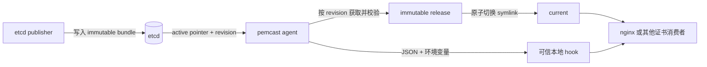

# pemcast

pemcast 是一个从 etcd 拉取 TLS 证书的本地 agent. 发布者先把完整的证书 generation 写入 etcd, 再切换 active 指针; pemcast 监听指针变化, 按 etcd revision 取回完整 bundle, 校验 SHA-256 与证书/私钥匹配关系, 然后在本地生成不可变 release 并原子切换 `current` symlink. 应用始终读取稳定路径, hook 在切换成功后触发服务重载.



## 设计要点

- 证书发布者与消费者解耦: pemcast 不包含签发, 审批或发布系统, 只消费一个明确的 etcd 协议.
- 远端 generation 不可变: 任何内容变化都使用新 generation 名, 避免读到半新半旧文件.
- 校验发生在启用前: manifest 严格解析, 文件逐一校验 SHA-256, 证书和私钥必须通过 `tls.X509KeyPair`, 并满足有效期策略.
- 本地发布是内容寻址的: release 目录名来自整个 bundle 的 digest, 相同内容不会重复写入.
- 应用路径稳定: 应用读取 `current/...`, pemcast 通过临时 symlink 和 rename 原子切换目标.
- 服务重载可重试: hook 在本地切换后执行, 失败会记录在 state 中, 由后续事件或周期 resync 重试.

## 快速上手

生成并修改配置:

```bash
pemcast config example > config/config.yaml
```

至少配置 `agent.etcd.endpoints`, 一个 target 的 `output.root`, mappings, validation pair 和 hook, 然后校验:

```bash
pemcast --config config/config.yaml config validate
```

发布者必须先写完整 generation, 再切换 active 指针. 以 `/pemcast/v1` 和 target `nginx` 为例:

```text
/pemcast/v1/active/nginx = 01K4GENERATION
/pemcast/v1/bundles/nginx/01K4GENERATION/manifest.json
/pemcast/v1/bundles/nginx/01K4GENERATION/files/fullchain.pem
/pemcast/v1/bundles/nginx/01K4GENERATION/files/privkey.pem
```

先不落盘测试远端内容:

```bash
pemcast --config config/config.yaml agent --once --dry-run
```

再执行一次同步或进入监听模式:

```bash
pemcast --config config/config.yaml agent --once
pemcast --config config/config.yaml agent
```

本地布局为:

```text
/etc/nginx/tls/
├── current -> .pemcast/releases/sha256-...
└── .pemcast/
    └── releases/
        ├── sha256-old/
        └── sha256-current/
```

应用读取:

```text
/etc/nginx/tls/current/fullchain.pem
/etc/nginx/tls/current/privkey.pem
```

同一个 output root 或 target set 只能运行一个 agent 进程. 当前 state 目录没有跨进程锁.

## Hook 契约

配置的可执行文件会在启用后直接运行, 不经过 shell. 它会从 stdin 接收一个 JSON 事件, 并获得以下环境变量:

```text
PEMCAST_TARGET
PEMCAST_GENERATION
PEMCAST_PREVIOUS_GENERATION
PEMCAST_ETCD_REVISION
PEMCAST_RELEASE_DIR
PEMCAST_CURRENT_DIR
PEMCAST_CHANGED_FILES
PEMCAST_BUNDLE_SHA256
```

hook 必须幂等. 失败时新证书文件可能已经启用, pemcast 会记录失败并在下一次 watch 事件或周期性 resync 时重试, 且不会重写同一个 release.

## 命令

```text
pemcast agent
pemcast agent --once
pemcast agent --once --dry-run
pemcast config example
pemcast config validate
pemcast version
```

配置由 `cfgm` 加载, 优先级为: 默认值, 第一个可用默认配置文件, 显式 `--config` 文件, `PEMCAST_*` 环境变量, 显式命令行参数.

## 项目 skills

仓库在 `.agents/skills/` 中包含三个 Codex skills:

- `$repo-architecture`: 架构, 包边界, 同步不变量和失败行为.
- `$repo-deployment`: agent 配置, etcd bundle 发布, 回滚, 运维和诊断.
- `$repo-development`: Go 修改, 包级测试, 生成配置, 构建和发布要求.

详细 references 位于:

- `.agents/skills/repo-architecture/references/architecture.md`
- `.agents/skills/repo-deployment/references/operation.md`
- `.agents/skills/repo-deployment/references/publishing.md`
- `.agents/skills/repo-development/references/development.md`

## 开发

```bash
go test ./...
go run ./cmd/pemcast --help
go run ./cmd/pemcast --config config/config.yaml config validate
```

`config/config.example.yaml` 由 `internal/config` 测试生成. 修改配置 schema 后运行 `go test ./internal/config`, 并提交更新后的示例文件.
